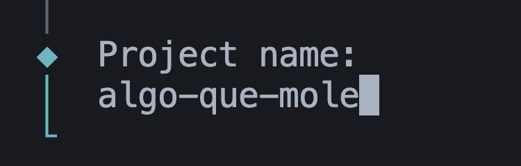
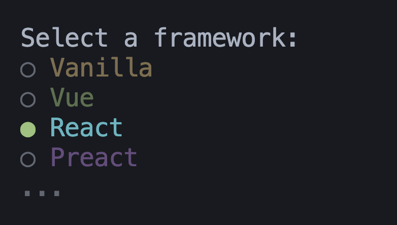
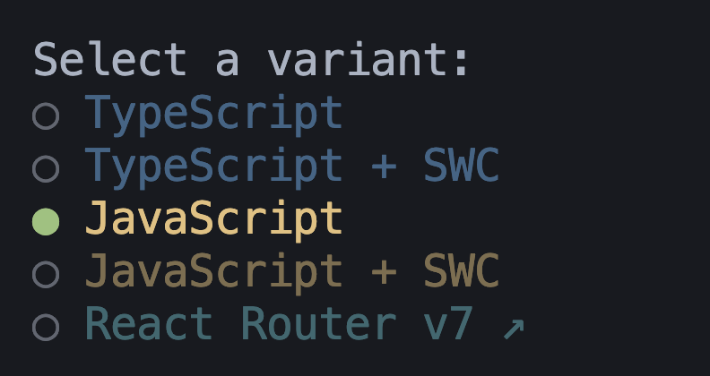
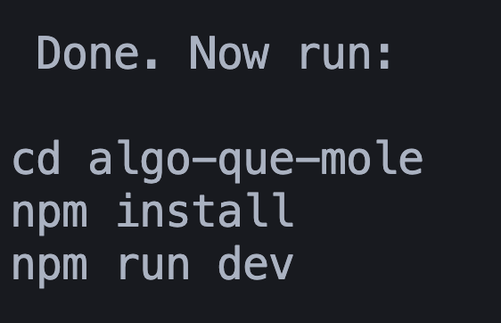
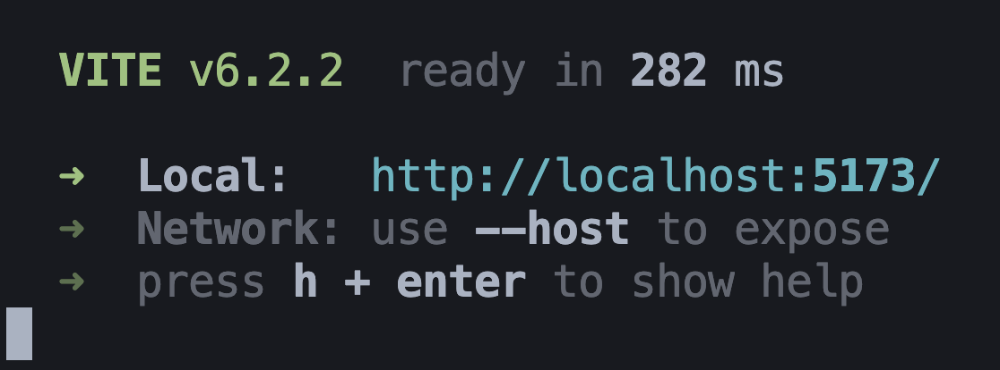
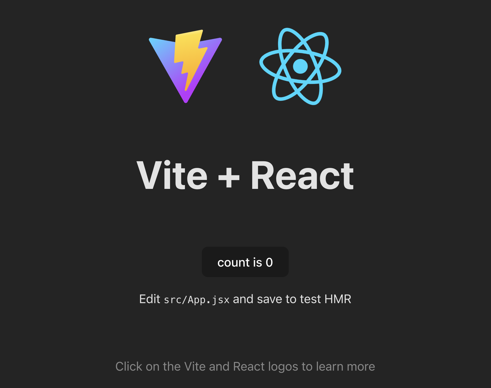

# learn-react
Repositorio para aprender React

## ¿Qué hay en esta rama `main`?

Proyecto de React con `vite`.

---

## npm & vite

- `npm` es un gestor de paquetes de `Node`.
- `vite` es más rápido que `create-react-app` 

---

## Requisitos

- Tener Node instalado. [Node](https://nodejs.org/en) => LTS es `Node 22`
  - Se comprueba con el comando: `node -v`
  - `npm` ya viene incluido en Node: `npm -v`
- Tener `vite` instalado:

```bash
  npm install -g vite
```
  - `vite -v`

(Si por lo que sea no hay error pero no encuentra `node` o `npm`=> reiniciar en Windows)

## Primer proyecto

- Abrimos el CLI de vite:
```bash
  npm create vite@latest
```
- Nombre del proyecto:

- Elegimos framework:

- Elegimos JS o TS:

- Finalmente, los comandos necesarios:


```bash
  cd mi-primer-react # entrar en la carpeta creada para el proyecto
  npm install        # instalamos las librerías necesarias
  npm run dev        # iniciamos el proyecto
```

- Vemos la página en localhost:


Resultado:


